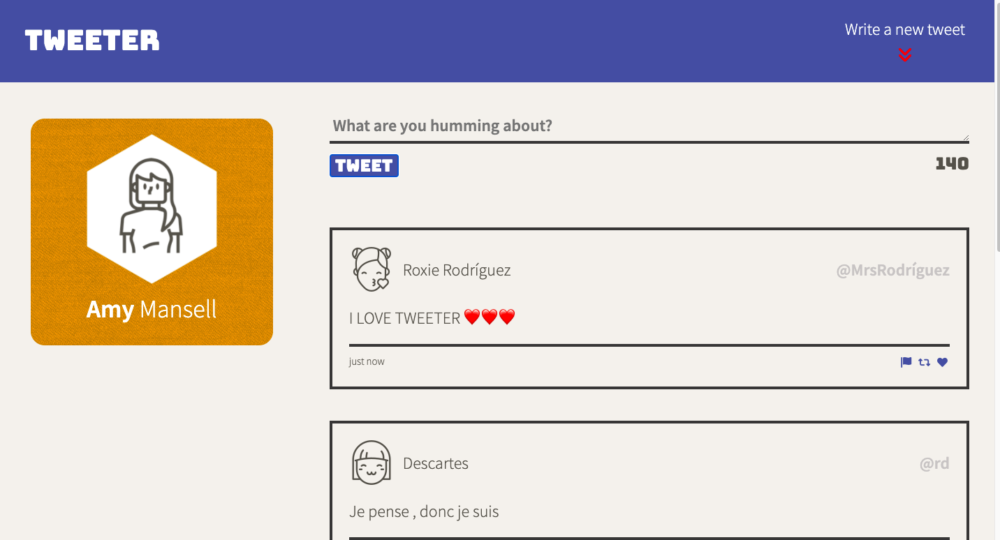

# Tweeter Project

Tweeter is a simple, single-page Twitter clone.

## Final Product

## Dependencies

- Node.js
- Express
- body-parser 
- chance 
- md5
- nodemon

## Getting Started

- Install all dependencies (using the `npm install` command).
- Run the development web server using the `npm run local` command.